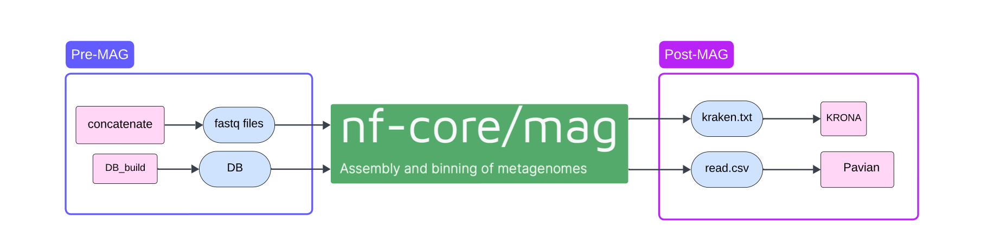

# Hydroscope-nf


The Hydroscope-nf pipeline, developed for wastewater based surveillance, augments the nf-core/mag pipeline to facilitate the work of the International Livestock Research Institute (ILRI) Keyna, in longitudinal pathogen surveillance in Kenyan cities using automated sequencing and processing, with implications for real-time public health monitoring.

## Design



## Installation and Test

To make sure that the pipeline has been installed and the installation works as expected, please issue the following command at the command line.


NOTE: The following command assumes that the correct version of `Nextflow`, `Java` and `Singularity` have been installed.

```
nextflow run GENPATH-bioinformatics/hydroscope-nf -profile test

```


